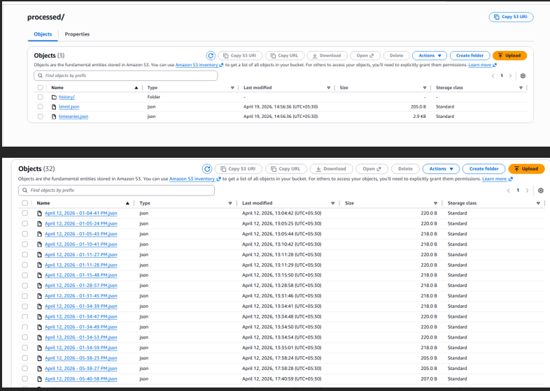
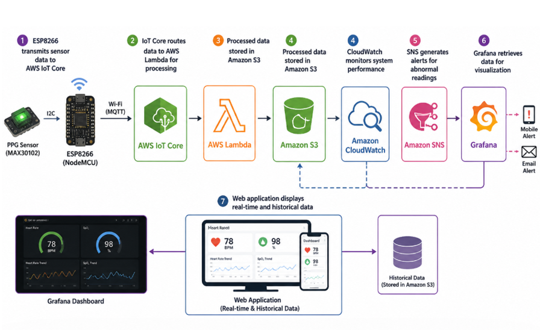

# DHADAK - Tele-Monitoring System

DHADAK is a real-time patient vitals monitoring dashboard and medical portal.

## Features
- **Medical Login Portal**: Role-based access for Doctors and Patients.
- **Doctor Dashboard**: Monitor multiple patients, view real-time vitals, and add clinical observations.
- **Patient Dashboard**: View personal health data, daily affirmations, and breathing exercises.
- **Clinical Forms**: Easy data entry for vital statistics.
- **Chatbot built_in**: Built with chatbase chatbot to assist in the patient dashboard which only answers to a      specefic knowledge base
- **Grafana**:For monitoring the vitals of the user
- **AWS setup**:To make use of AWS global infrastructure.

## Tech Stack
- HTML5, CSS3, JavaScript
- Bootstrap 5
- FontAwesome / Bootstrap Icons
- LocalStorage for data persistence (Demo version)
- Grafana (local)

### AWS Backend
- AWS IoT Core
- AWS Lambda
- Amazon S3
- Amazon SNS
- Amazon CloudWatch
- Grafana

### Hardware
- ESP8266 (NodeMCU)
- MAX30102 PPG Sensor
- oled

## Project Structure
- `index.html`: Entry point (Login Portal).
- `dashboard_doctor.html`: Main doctor monitoring screen.
- `patient_selector.html`: Patient list for doctors.
- `patient_form.html`: Clinical data entry.
- `dashboard_patient.html`: Individual patient dashboard.
- `css/`, `js/`, `img/`, `login/`,`assets/`: Assets and components.

## How it works
Data from MAX30102 sensor is sent to  AWS IOT CORE using MQTT through ESP8266.
IOT CORE forwards this data to AWS LAMBDA where processing of the data is done 
using Chebyshev filter to get accurate values. SNS is also setup here to have alerts for
trigger points.This data is then stored within s3 with the following structure:

Data from lambda is also sent to grafana to have accurate and realtime visualizations of data.

## Challenges (resolved)
All data was being stored within one bucket without any proper timestamps
Hit and trial across various filters
Making the code memory and optimized when shifting from esp32 to esp8266 to save money.

## Cloud Setup

## Setup Requirements
- AWS account with IoT Core, Lambda, S3, SNS, CloudWatch configured
- ESP8266 with MAX30102 sensor (hardware component)
- Grafana instance for visualization
- Web server or AWS Amplify for frontend deployment

Note: This is a full system project. 
Frontend demo can be viewed by opening index.html directly in browser.

NOTE: ESP8266 CODE BY NEXT WEEK.
